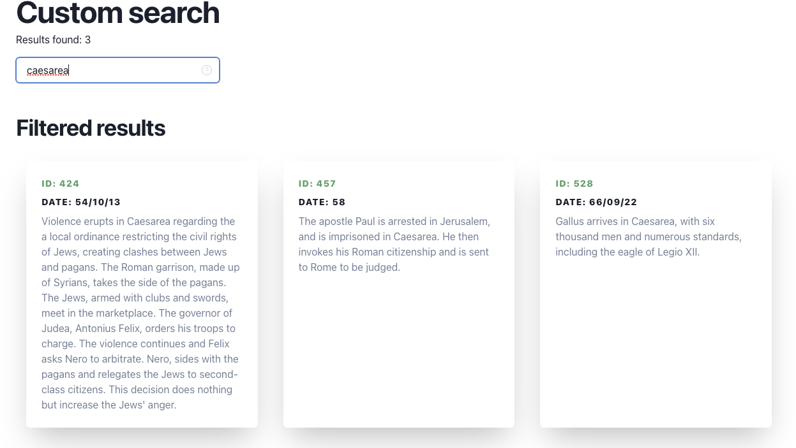
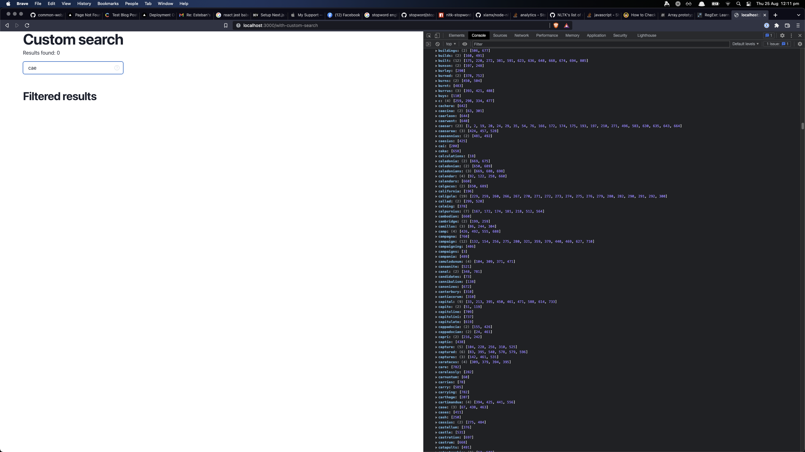
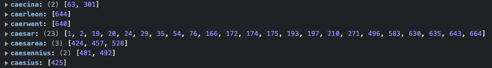
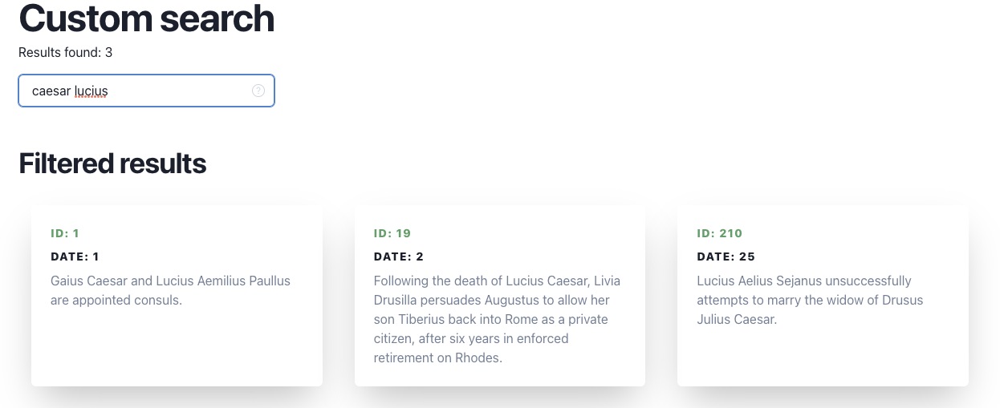
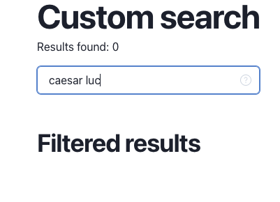

# Why does this repository exist?

This is the result of a code challenge that involved the following technologies: ReactJS, NextJS, Chakra-UI, Fuse.js and MeiliSearch. The structure is simple, but it follows good practices from the first commit such as the use of javascript linter (ESLint), the use of typescript, it also shows a clear separation and definition of components, pages, types and hooks.

## Brief: Search History

Build a simple application that allows users to search this JSON data set of historical events.

### Basic Functionality

Users can enter search terms into a text field. Historical events that match the search terms are
displayed as a list.

- The JSON data can either be embedded into the application or fetched over the network
- Use of third-party libraries is fine, though of course it’s your own code that we’ll be
looking at

#### Extra Credit

This is your chance to show us what you can really do! Add one or more of the following
features, or come up with your own idea...

- Real time update
- Imperfect matches (e.g. allowing for differences in whitespace, spelling etc.)
- Auto-complete
- Ordering results by quality of match
- ...or any other cool feature you can think of

## How to use

Nextjs preview: https://mh-code-challenge.vercel.app/

OR

1. Download the repo [or clone it]
2. Install dependencies and run

    ```bash
    yarn
    yarn dev
    ```

3. Open [http://localhost:3000/with-custom-search](http://localhost:3000/with-custom-search) with your browser to see the result. There are multiple pages that can be accesed, each of them you need to add the path to the route e.g.: `localhost:3000/with-serverside`. More info about that [here](#about-the-different-pages).

### About the implementation

Well, I know a bit about the theory behind word search, not just ElasticSearch or Google, general word search is based on the same theory, but each adds more layers of complexity on top of that. But, the simplest solution might be some kind of inverted index, I'd try creating a basic one. Let's use some data from the challenge:

```md
document 1: Tiberius, under order of Augustus, quells revolts in Germania (1–5).
document 2: Gaius Caesar and Lucius Aemilius Paullus are appointed consuls.
document 3: Gaius Caesar marries Livilla, daughter of Antonia Minor and Nero Claudius Drusus, in an effort to gain prestige.
```

There are a lot of words but if we concentrate more on people names, we can generate something like the following.

|  word | documents   |
|---|---|
| Tiberius  | d1  |
|  Augustus | d1  |
| Germania  | d1  |
| and    | d1 |
|  are   | d1 |
| Gaius  | d2, d3  |
| Caesar  | d2,d3  |
| Lucius  | d2  |
| Paullus  | d2  |
| Livilla  | d3  |
| Antonia  | d3  |
| Claudius  | d3  |
| Drusus  | d3  |

To generate this index, we are going to do the next:

```js
// utils/generateInvertedIndex.ts
export const generateInvertedIndex = (data: IHistoricalDate[]) => {
  const invertedIndex: IInvertedIndex = {};
  // e.g. { 'caesar': [ 1 , 2 ], 'julius: [3] }

  data.forEach((item) => {
    // let's just focus on the description for now
    const { description } = item;

    // let's tokenize the description
    // e.g. "Gaius Caesar and Lucius Aemilius Paullus are appointed consuls."
    // would generate ["gaius", "caesar", "and", "lucius", "aemilius", "paullus", "are", "appointed", "consuls"]

    const words: string[] = description
      // remove any character that is not alphanumeric or whitespace
      .replace(/[^\w\s_]/g, " ")
      //replace double white space for single space
      .replace(/\s+/g, " ")
      // lets convert to lowercase
      .toLowerCase()
      //hopefully, splitting individual words
      .split(" ")
      // filter by stopwords
      .filter((w) => w && !stopWordsEng.includes(w));

    // iterate over words to populate the index
    words.forEach((word) => {
      if (!invertedIndex[word]) {
        invertedIndex[word] = [item.id];
      }
      // if the word is already in the index and the document is not already included
      else if (
        invertedIndex[word] &&
        !invertedIndex[word].find((i) => i === item.id)
      ) {
        invertedIndex[word].push(item.id);
      } else {
        // nothing
      }
    });
  });

  return invertedIndex;
};
```

The actual output of that function throw 26 words for our index, you can find the test that simulates the situation explained [here](utils/generateInvertedIndex.test.ts#7). I did some extra steps that would allow us to have a better index. Just a quick update on that:

1. Removing any non-alphanumeric character, whitespace, or underscore
2. Convert everything to lowercase
3. Elimination of stop words, that is, a list of words that are so frequent in any conversation or text that they do not add any relevant information in the search. eg *and*, *are*.
4. Sort the results alphanumerically
5. Next, we create an index that shows the documents related to the words we want.

|  word | documents   |
|-------|-------------|
| antonia  | d3  |
| augustus  | d1  |
| caesar  | d2, d3  |
| claudius  | d3  |
| drusus  | d3  |
| gaius  | d2, d3  |
| germania  | d1 |
| livilla  | d3  |
| lucius  | d2 |
| paulus  | d2  |
| tiberius  | d1  |

So now let's say we want to filter on the word "caesar" using the created index. We can quickly return items 2 and 3 and we just need to search the above list instead of searching the entire dataset. If we search for "caesar lucius", then item 3 can no longer be considered, so the answer is only item 2.

The code for that would be something like this:

```js
export const testInvertedIndex = (
  invertedIndex: IInvertedIndex,
  searchText: string
) => {
  let results: number[] = [];
  let matches = 0;

  searchText
    .replace(/[^\w\s_]/g, " ")
    .replace(/\s+/g, " ")
    .toLowerCase()
    .split(" ")
    .filter((w) => w)
    .forEach((token) => {
      // check if the token is an actual key in the dictionary
      if (invertedIndex[token]) {
        // first match, add all the documents
        if (matches === 0) {
          results = results.concat(invertedIndex[token]);
        } else {
          // remove from the results, documents that are not considered in new iterations
          results = results.filter((result) =>
            invertedIndex[token].includes(result)
          );
        }

        // increase the number of matches
        matches++;
      }

      // regex match
      else {
        Object.keys(invertedIndex).forEach((ivKey) => {
          if (ivKey.match(token) !== null) {
            if (matches === 0) {
              results = results.concat(invertedIndex[ivKey]);
            } else {
              results = results.filter((result) =>
                invertedIndex[ivKey].includes(result)
              );
            }

            matches++;
          }
        });
      }
    });

  return results;
};
```

The results using Jest are promising. So let's try with the full corpus and with the website.

### Testing on website

Let's try to do a similar test than what we did on [jest](utils/generateInvertedIndex.test.ts).

1. Searching for "caesar", show us inmediatly what we are looking.


2. Searching for "caesarea"



3. Considering the situation with "caesar" and "caesarea". I would expect if I search for "cae", to obtain both results at least buuuuut.




Ok, that doesn't look good.

4. Searching for "cease".

We obtained the same result. Ok, we need to establish that the algorithm is not doing a good job of mixing results for multiple matches in the dictionary. In the earlier test, the documents doesn't include similar words, so we were not able to see this.

There is an opportunity to grow here because we can assign scores based on the number of matches. But I would say that this requires more thought about when we should include results and when not.

5. Searching for "caesar lucius" actually show some documents.



6. Searching for "caesar luc", due it's partial match we experience the same issues that we observed before.



## Outcomes

- We learn that we can create an inverted index from scratch with fair results.

- We need to identify root words. A good example for that is words in plural or singular e.g. apple and apples. But also words more complex like for example: `caesar` and `caesarean`. There is a chance that some of these words can be grouped together due they share meaning. Just be aware that this process is not arbitrary and it requires a deep knowledge on the topic.

- We need to optimize the algorithm to be able to include multiple matches from different elements in our dictionary, as demostrated before, for now they are not intersecting results.

- We need to use the full corpus or a better subset to test correctly the new changes. For that we need to improve the [existing tests](utils/generateInvertedIndex.test.ts).

## About the different pages

My original approach was to compare different solutions between client-side and server-side because, in my head, there's always some point where that decision is relevant. For the server side, I tried the best implementation I found, which was a Rust based service, sadly I didn't learn more about Rust :(.

Now that I've decided to focus more on the idea of ​​creating my custom search algorithm, the other pages are for comparing algorithm results.

1. `with-custom-search`: As commented above, i decide to create my own implementation of reversed index.
2. `react-use-fuzzy`: Technically, its just react with [Fuse.js](https://fusejs.io/) but through a handy hook called [react-use-fuzzy](https://github.com/joshuatonga/react-use-fuzzy).
3. `debounced-fuse`: I was not happy with the hook library, so i decided to use directly Fuse.js and also i added some additional hooks to ensure that for example we don't have to do extra calls to the searcher algorithm.
4. `with-serverside`: The option 1 and 2 are client-side, so in this case i decided to try server-side. There are multiple options as the popular `Elastic search` but i decided to try a solution based on Rust called [MeiliSearch](https://www.meilisearch.com/).

The docs are really useful and I ended creating a cloud instance with the data, so basically I'm query against that instance:

```bash
QUERY_URL=https://meilisearch-production-f61d.up.railway.app/
API_KEY= StrongKeyIncluding123
```

You can hit the query url in the browser and its going to display some kind of preview website, you would need the API_KEY to do queries though.

## Aditional thoughts

1. I was thinking of this idea of use synonyms through Tensorflow. I did something like that a while ago but it would be interesting to run it in a different area. More info about that work:

    - <https://www.commoncode.io/blog/kaggle-covid-challenge>
    - <https://www.kaggle.com/code/estebancampos/covid-19-scientific-papers-with-doc2vec/notebook>
